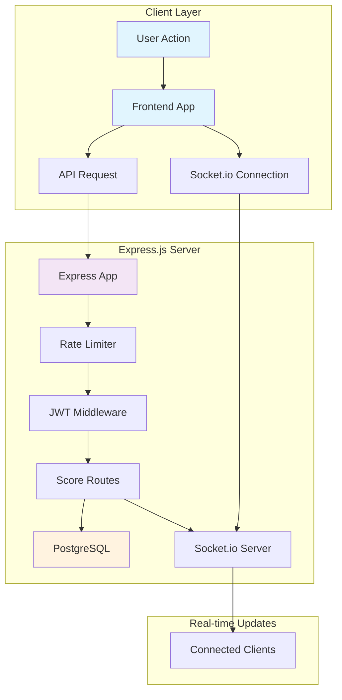
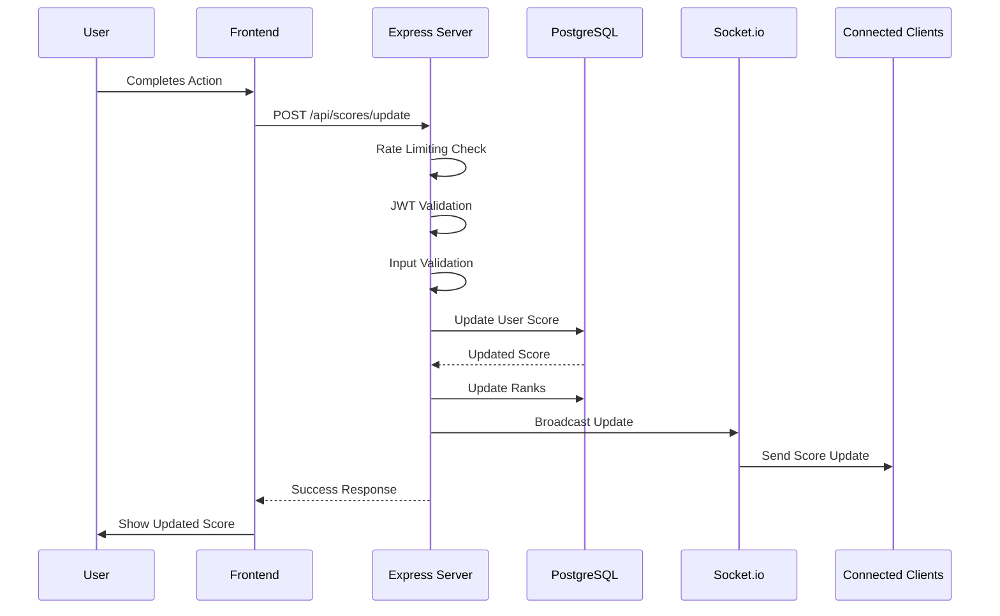
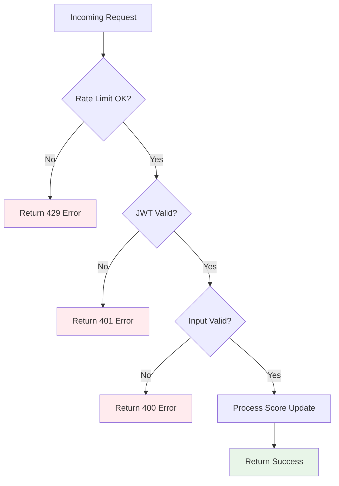
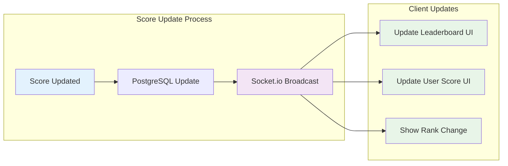
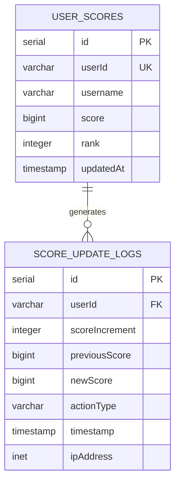
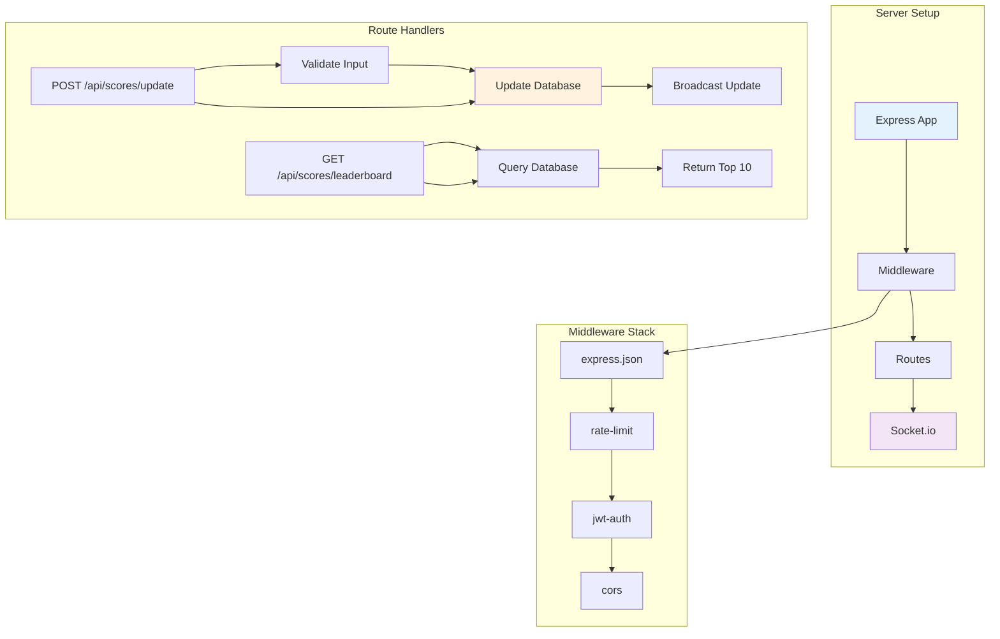

# Live Scoreboard API - Execution Flow Diagrams

## System Architecture Flow (Express.js)

## Score Update Flow

## Security Flow

## Real-time Update Flow (Socket.io)

## Database Schema (PostgreSQL)

## Express.js Implementation Flow

