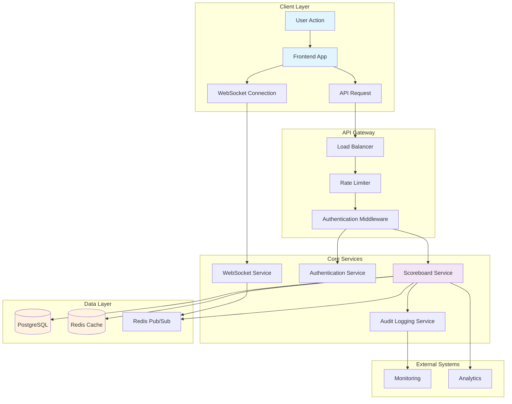
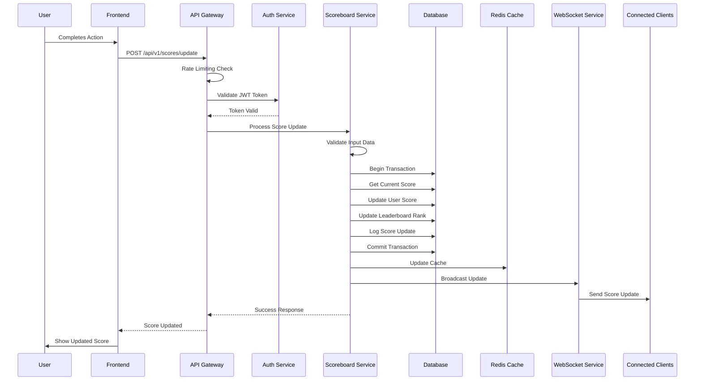
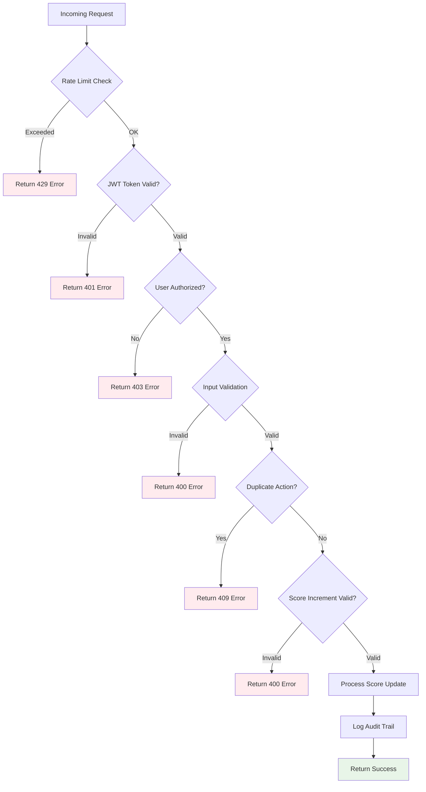
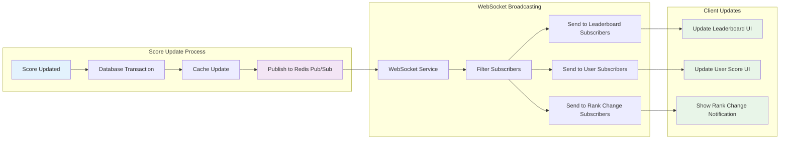
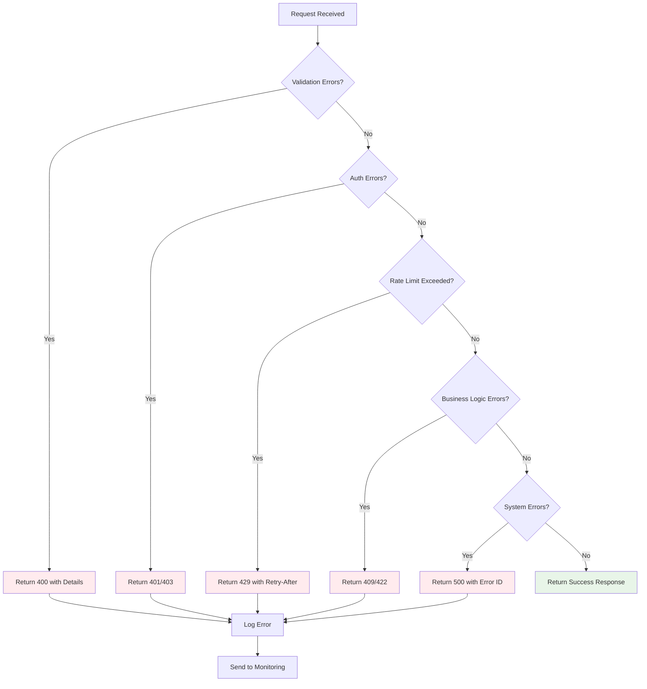
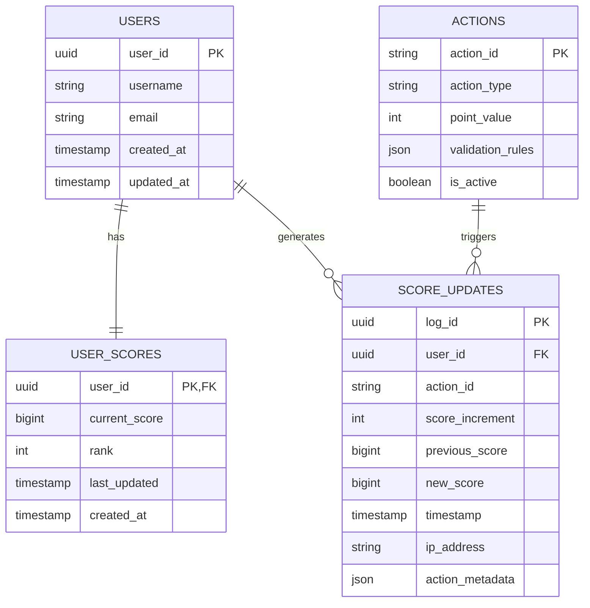
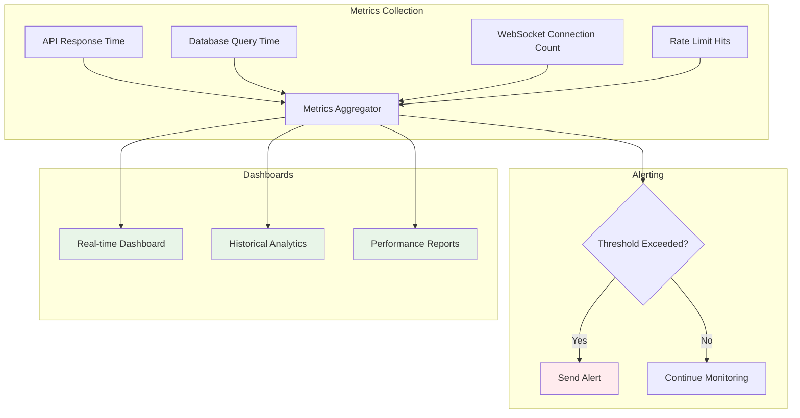

# Live Scoreboard API - Execution Flow Diagram

## System Architecture Flow

## Score Update Flow

## Security Flow

## Real-time Update Flow

## Error Handling Flow

## Database Schema Relationships

## Performance Monitoring Flow

